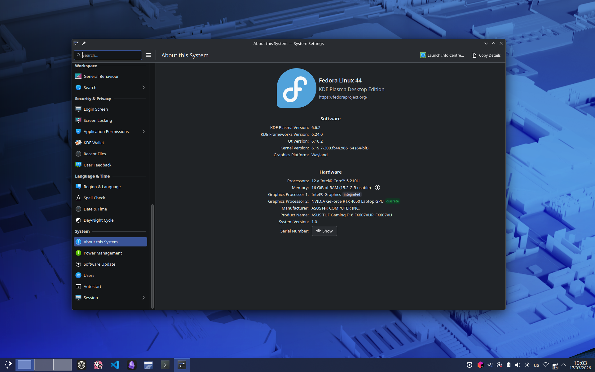

# Встановлення й початкове налаштування системи

У цьому розділі я крок за кроком покажу, як встановити Fedora Linux, розповім про її редакції, поясню, як правильно встановити драйвери NVIDIA та допоможу виконати базове налаштування системи для комфортної роботи.


У цьому GitBook розгляд здійснюватиметься на прикладі редакції Fedora KDE Desktop.


<figure><figcaption></figcaption></figure>
